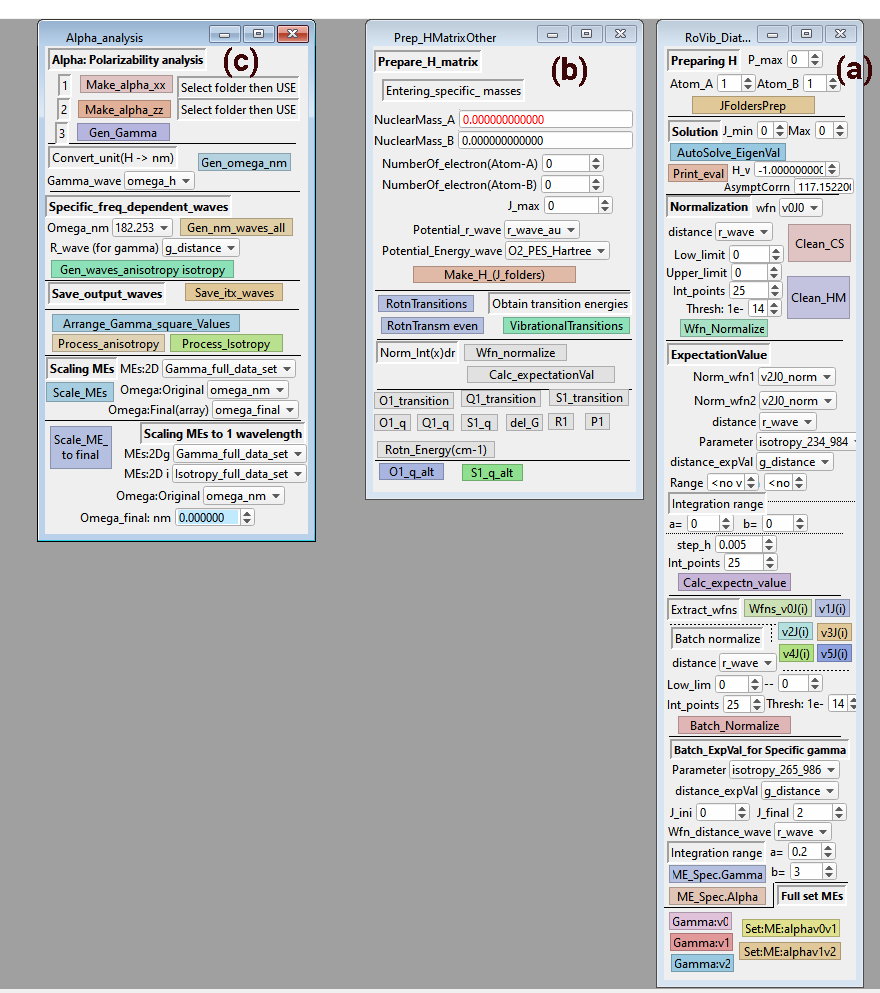

# Usage

Load all the procedures in IgorPro first, then press compile. After this run `ini_hm(); ini_alpha()` in the command browser. This will open a total of three panels showing various buttons for defining the input and running the calculation.

**Panel (a)**: prepare H section is for H2 and isotopologues.
The other sections are general in nature and can be used for other systems as well.

**Panel (b)**: Prepare_H_matrix is for general diatomic system, for a given potential and inter-nuclear distance available as 1D waves.
The other sections are for viewing the results after computation, i.e. print out the energy levels for various transitions.

**Panel ( c)**: For processing polarizability data available as 2D over wavelength and inter-nuclear distance. Functions for the interpolation of polarizability over specific wavelengths are included. For this part of computation, i.e. computation of matrix elements for specific wavelength, refer to faster implementations in python/FORTRAN used in the repository. (https://github.com/ankit7540/H2-PolarizabilityMatrixElements)

Use Issues questions to raise questions.
